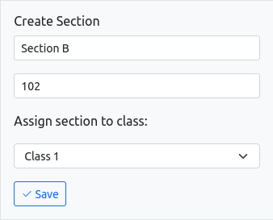
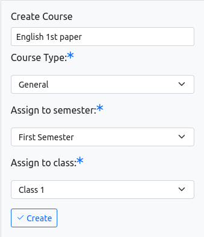

# Skuulu


## Version 2.X est là !

Pour la version 1.X, consultez les [versions précédentes](https://github.com/changeweb/Skuulu/releases). La prise en charge de la version 1.X continue dans la branche [v1-x-branch](https://github.com/changeweb/Skuulu/tree/v1-x-branch).

### Logiciel de Gestion Scolaire et Comptabilité

[](https://travis-ci.org/changeweb/Skuulu)

[](https://travis-ci.org/changeweb/Skuulu)
[](https://codeclimate.com/github/changeweb/Skuulu)
[](https://github.com/changeweb/Skuulu/releases)
[](https://madewithlaravel.com/p/Skuulu/shield-link)
[](https://discord.gg/8sz6kpup99)
[](https://github.com/changeweb/Skuulu/issues?q=is%3Aissue+is%3Aopen)

Nous aimons remettre en question la qualité de ce que nous construisons pour l'améliorer. Pour ce faire, nous essayons de rendre le logiciel intuitif, beau et facile à utiliser. L'innovation et le travail acharné aident à satisfaire ces exigences. Je crois qu'il est nécessaire de penser différemment pour innover. Il y a quelques mois, j'ai découvert qu'il n'y avait pas de logiciel gratuit et open source de gestion scolaire qui répondait à mes critères de qualité. Sachant un peu programmer, j'ai décidé d'en créer un. Je crois aussi que travailler avec plus de personnes peut pousser le standard plus haut que de travailler seul. Ainsi, j'ai décidé de le rendre open source et gratuit.

### Présenté sur Laravel News !!


[Voir la nouvelle ici](https://laravel-news.com/unified-transform-open-source-school-management-platform)

### Framework utilisé

-   [Laravel 8.X](https://laravel.com/docs/8.x)
-   [Bootstrap 5.X](https://getbootstrap.com/docs/5.0/getting-started/introduction/)

### Exigences du serveur

-   PHP >= 7.4
-   Extension PHP OpenSSL
-   Extension PHP PDO
-   Extension PHP Mbstring
-   Extension PHP Tokenizer
-   Extension PHP XML

### Tests

Nous voulons des logiciels testables. La plupart des parties du logiciel dans la version précédente 1.x étaient couvertes par des tests. Couvrons également la version 2.x. Vous pouvez également contribuer en rédigeant des cas de test !

Pour exécuter les tests de fonctionnalités et unitaires, suivez les commandes suivantes :

```bash
$ docker exec -it app sh
// Dans le shell du conteneur
:/# php artisan test
```

### Licence

Skuulu est sous Licence Publique Générale GNU v3.0

### Contribuer

Skuulu est 100% open source et gratuit pour toujours ! La contribution communautaire peut rendre ce produit meilleur ! Rejoignez-nous !

Image d'analyse Repobeats

Lorsque vous contribuez à un projet Github, vous acceptez les Conditions d'Utilisation de Github (Contributions Sous Licence de Répertoire).

### Nouveautés

v1.0X est construite à partir de zéro. L'interface utilisateur et le workflow interne de l'application sont modifiés pour un meilleur design.

## Fonctionnalités à migrer de v0.7X à v1.X

Les fonctionnalités suivantes existant dans v1.X seront ajoutées dans v2.X également à l'avenir.

-   Paiement Stripe
-   Messagerie
-   Gestion de la bibliothèque
-   Gestion des revenus et dépenses
-   Exportation et importation en masse des étudiants et enseignants.
-   Impression de rapports
-   Gestion des certificats.
-   Prise en charge d'autres langues (français, lingala,...).

### Étapes d'installation

1. Clonez ou téléchargez le dépôt.
2. Créez un dossier **purify** dans le répertoire `storage/app/`.
3. Exécutez `cp .env.example .env`.
4. Exécutez `docker-compose up -d`.
5. Exécutez `docker exec -it db sh`. Dans le shell, exécutez :
    ```bash
    :/# mysql -u root -p
    mysql> SHOW DATABASES;
    mysql> GRANT ALL ON skuulu.* TO 'skuulu'@'%' IDENTIFIED BY 'secret';
    mysql> FLUSH PRIVILEGES;
    mysql> EXIT;
    ```
6. Enfin, sortez du conteneur en exécutant `exit`.
7. Exécutez `docker exec -it app sh`. Dans le shell, exécutez :
    ```bash
    :/# composer install
    :/# php artisan key:generate
    :/# php artisan config:cache
    :/# php artisan migrate:fresh --seed
    ```
    Puis sortez du conteneur.
8. Visitez **http://localhost:8080**. Identifiants de connexion de l'administrateur :
    - Email : admin@skuulu.com
    - Mot de passe : password

### Étapes à suivre

Veuillez suivre attentivement les étapes pour configurer l'école dans Skuulu :

**Rôle : Administrateur**

#### Dashboard de l'École

##### 1. Créer une Session Scolaire

Après vous être connecté pour la première fois, vous verrez le message suivant dans la barre de navigation supérieure. Pour créer une nouvelle session, allez à la page **Paramètres académiques**.


##### 2. Créer un Semestre

Créez maintenant un semestre. Un semestre dure généralement de 3 à 6 mois.


##### 3. Créer des Classes

Créez des classes en donnant des noms courants comme **Classe 1** ou **Classe 11 (Science)**.


##### 4. Créer des Sections

Créez des sections pour chaque classe, attribuez un nom (par exemple, Section A, Section B), un numéro de salle et associez-les à la classe respective.



##### 5. Créer des Cours

Attribuez des cours aux semestres et classes appropriés.



### Rôle : Enseignant

#### Dashboard de l'Enseignant

Les enseignants peuvent gérer leurs cours, prendre et consulter les présences, consulter et créer des devoirs, donner des notes, et plus encore.

### Rôle : Étudiant

#### Dashboard de l'Étudiant

Les étudiants peuvent consulter leurs cours, les présences, les notes, et télécharger les programmes des cours et devoirs.
